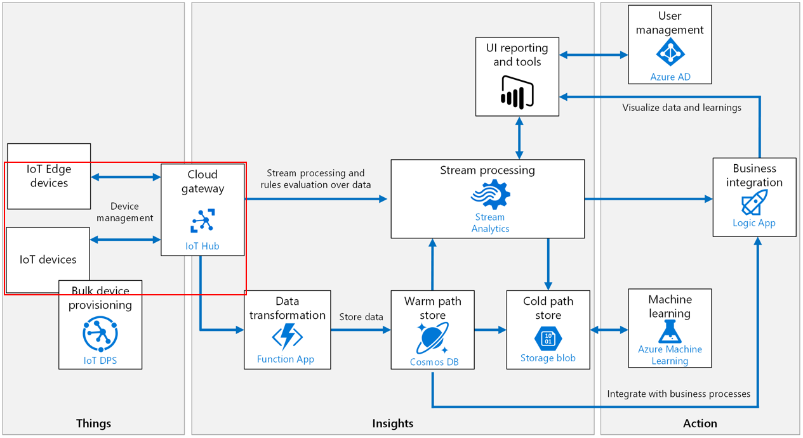
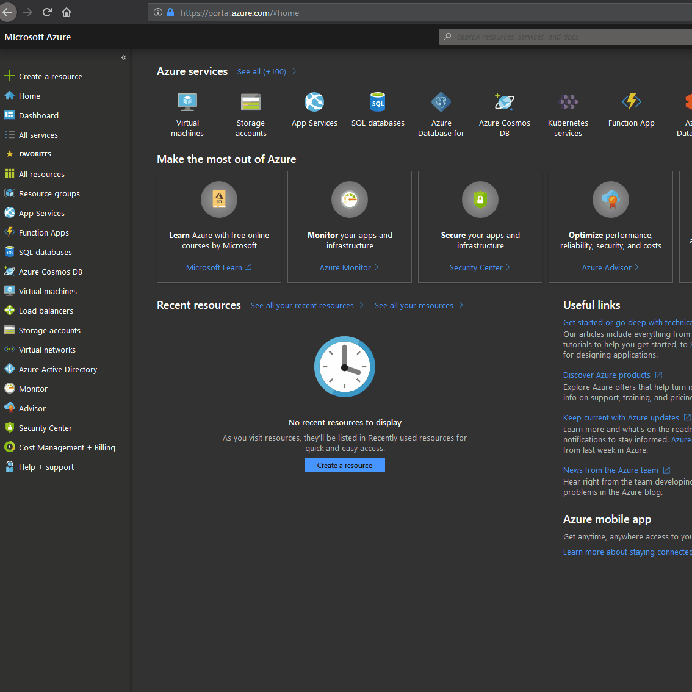
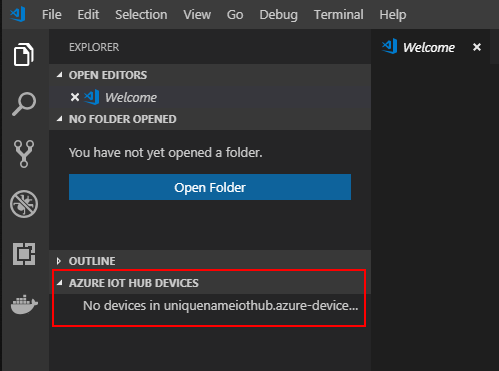
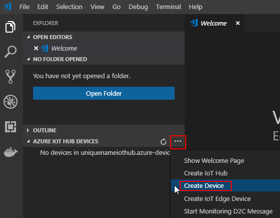
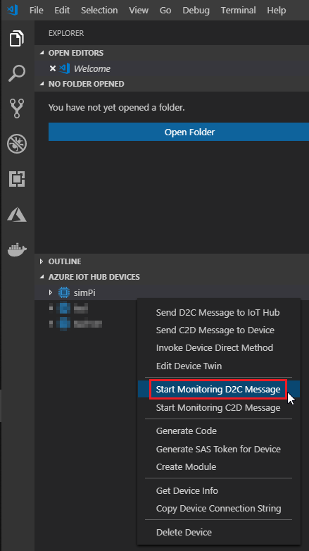
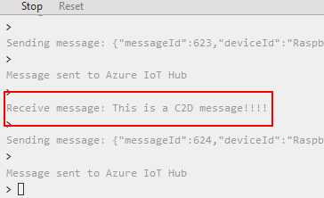
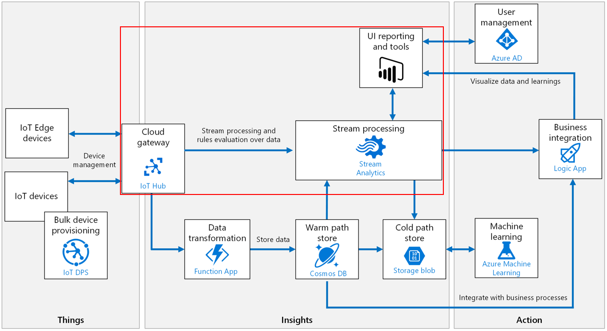
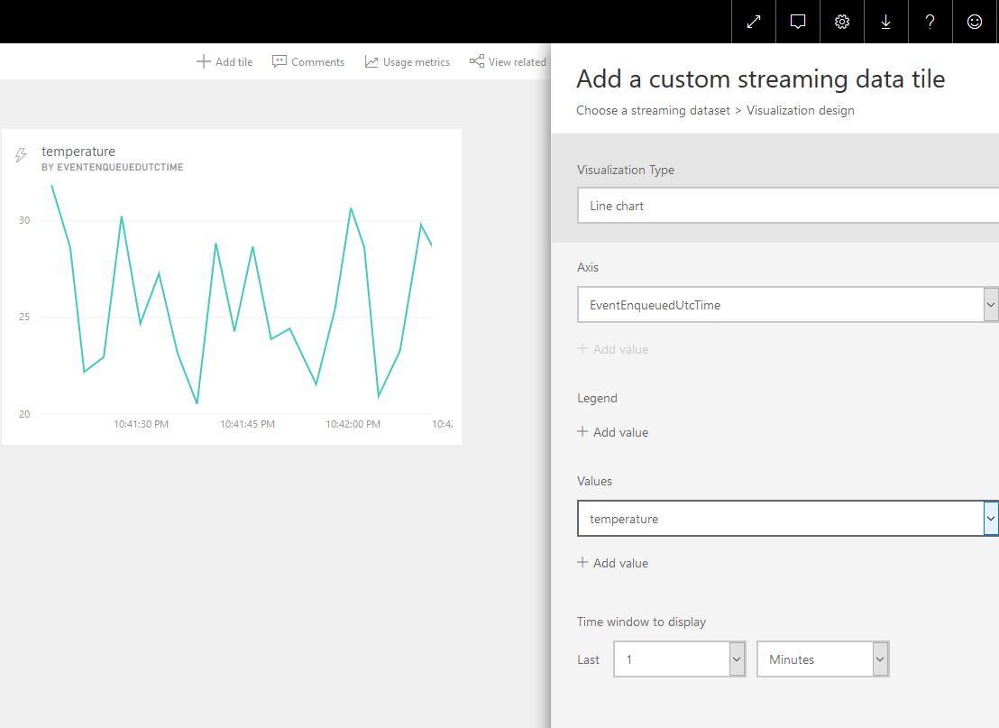
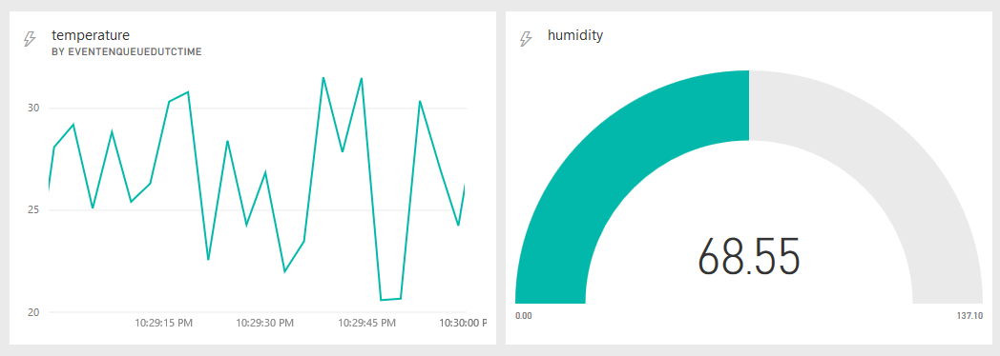
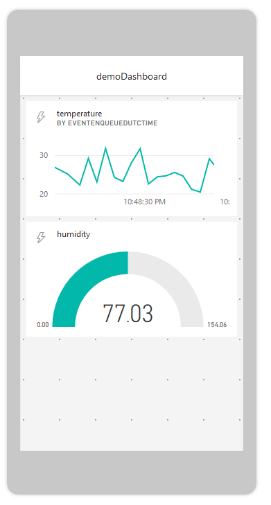

# Azure IoT Intro workshop
## Goals
- Get to know the Azure IoT platform and its tools
- Understand IoT business use cases and applications
- Learn how to connect a device, send device-to-cloud (D2C) and cloud-to-device (C2D) messages, and build custom dashboards
- Apply all you've learned with your devices at home and create your own IoT solutions!

# Main Topics
- Azure IoT Hub
- Azure Stream Analytics
- PowerBI

# Pre-requisites
- An Azure account:
https://docs.microsoft.com/en-us/learn/modules/create-an-azure-account/1-introduction

- A PowerBI account:
https://docs.microsoft.com/en-us/power-bi/service-self-service-signup-for-power-bi

- For the MXChip, since it's a headless device, you need a Wi-Fi network that requires a password-based authentication. Using a free Wi-Fi Access Point where the login is through a web client will not work with this device.

# Setup
## 1) Install Visual Studio Code (VS Code) and the IoT Hub Toolkit extension
https://code.visualstudio.com/download

https://marketplace.visualstudio.com/items?itemName=vsciot-vscode.azure-iot-toolkit

## 2) In VS Code, sign-in to your Azure account
- Press F1 and write ```Azure: Sign In```


-----

# Connecting a device and verifying bi-directional communication (D2C and C2D)

This first part of the workshop focuses on the initial steps of an IoT architecture.

Getting **Things** to generate data, and connecting them to Azure:


<!-- TODO: Adjust square -->


## 1) Create an IoT Hub

- Click "Create a resource" on the top left corner
- Search for "IoT Hub"
- Click "Create" at the bottom
- Enter these parameters into your IoT Hub:
  - **Subscription:**   "Azure Pass - Sponsorship"
  - **Resource Group:** "iot" (any name is ok, resource groups are like desktop folders for Azure resources)
  - **Region:** "West Europe" (or whatever region is closest to your devices)
  - **IoT Hub Name:** "uniquenameiothub" (each IoT Hub is an internet-accessible endpoint, so names must be unique)
- Click "Size and Scale" and select F1:Free (8000 messages of 0.5Kb each, per day)

**NOTE:** Upgrading from an F1 IoT Hub is not possible. [Pricing details and message limits](https://azure.microsoft.com/en-us/pricing/details/iot-hub/)


<!-- TODO: Add settings, steps -->

<!-- TODO: More context on each step -->

## 2) Connect your IoT Hub to VS Code, so you can easily manage it

- Get the **IoT Hub key** (Shared Access Policy)
-----
If this is your first time using Azure, check [this side-note] on how resource keys work for IoT.

[this side-note]:./keys.md

-----
- Open VS Code
- F1 > ```set iot hub connection string```


- Paste the IoT Hub key in VS Code and make sure you see something like this:




## 3) Register a new device
- Hover over the "Azure IoT Hub Devices" extension tab and click "..."
- Click "Create Device"



- Type a device name, like "my1stdevice" for example and press enter
- Right-click the newly registered device
  - Click "Copy Device Connection String"
- Save the connection string for later, or just copy it again from VS Code when you need it

We have just told the IoT Hub that a new device called "my1stdevice" will be connecting soon. So the IoT Hub generated a connection string (also called key) that is unique for that device.

We can now program this connection string on the device directly, which ensures the device was programmed by an IoT Hub admin. There are other (more secure!) ways of ensuring trust between a device and the IoT Hub. [More details on security.](https://docs.microsoft.com/en-us/azure/iot-hub/iot-hub-devguide-security)


## 4) Connect an MXChip to your IoT Hub

**NOTE:** If you'd prefer to try this out with a Raspberry Pi (real or web-simulated) check out step 4 in [this page.](./raspberryPi.md).The steps below are for the MXChip.

- Configure the MXChip as described in the [get-started](https://microsoft.github.io/azure-iot-developer-kit/docs/get-started/) guide and make sure you can upload the *GetStarted.ino* sketch

- Create a new project for the .ino code
  - F1 > ```workbench create project```


- Clone this repo
- Copy the cloned _device.ino_ from this repo (./src/mxchip) to your project folder and overwrite the generated _device.ino_

This code is sending D2C messages every 5000ms by default. You can increment/decrement this time interval by holding the A/B buttons until the OLED screen shows the new time interval.

<!-- TODO: Steps 4,5,6 are very device dependent. Make an MXChip "branch" -->

## 5) Monitor for messages arriving to the IoT Hub with VS Code
- Open VS Code
- Right-click your device
- Click "Start Monitoring D2C Message"



You should now be able to see in real-time:
- D2C messages being sent by the MXChip at the frequency stated in the OLED screen
- VS Code pulling those same D2C messages from Azure into your VS Code console

<!---->

<!-- ## 6) Send a C2D message

- Open VS Code
- Right-click your device
- Click "Send C2D Message to Device"
- Write anything you want!
- Verify you see that message in your simulated device browser tab:

 -->

-----

# Creating a dashboard from this device and its data
This second part of the workshop focuses on the cloud-side of an IoT architecture.

Getting **Insights** from the plots drawn by a UI reporting tool (PowerBI), using the data gathered by **Things**:



- Follow this tutorial and stop at "Create and publish a Power BI report to visualize the data"

https://docs.microsoft.com/en-us/azure/iot-hub/iot-hub-live-data-visualization-in-power-bi

- Open your workspace
- (you may have to click skip in an intro screen)
- Click "Datasets" and verify your dataset is there. If it's not, double-check that the Stream Analytics job is running, your device is sending messages, and your IoT Hub is receiving them


- Add a new dashboard (Top-right _+Create>Dashboard_)
- Add a new streaming data tile to the empty dashboard (Top center bar _+Add Tile > Custom Streaming Data_)
- Select your dataset
- Change _Visualization Type_ to _Line Chart_ and configure it like so:



- Add more dashboards and experiment with the visuals you can create, here is an example:



# Bonus!

- Install the PowerBI app on your smartphone

https://play.google.com/store/apps/details?id=com.microsoft.powerbim&hl=en

https://itunes.apple.com/us/app/microsoft-power-bi/id929738808?mt=8

- Configure your phone dashboard (Top-right _Web-View_ or _Phone-View_)



- Check that same data live-streaming on your smartphone!


-----
This introductory workshop on Azure IoT has been delivered for:
- FCT-UNL students in 04/02/2019
- IST students in 14/03/2019
- PixelsCamp developer audience in 21-23/03/2019